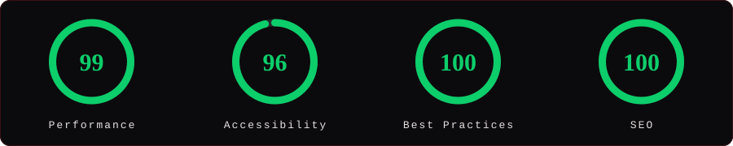

 

**Live site:** [ophion-tool-vault.grimmoir.workers.dev](https://ophion-tool-vault.grimmoir.workers.dev)

<a href="https://ophion-tool-vault.grimmoir.workers.dev/tools"><b>Tools</b></a>
&nbsp;·&nbsp;
<a href="https://ophion-tool-vault.grimmoir.workers.dev/tricks"><b>Tricks</b></a>
&nbsp;·&nbsp;
<a href="https://ophion-tool-vault.grimmoir.workers.dev/resources"><b>Resources</b></a>
&nbsp;·&nbsp;
<a href="https://ophion-tool-vault.grimmoir.workers.dev/about"><b>About</b></a>

  

 

> [!NOTE]
> This is the documentation repository for Ophion. It is published for public viewing only. See [License & Copyright](#license--copyright).

<b>Table of Contents</b>

 

1. [What is Ophion?](#what-is-ophion)
2. [The Story Behind the Name](#the-story-behind-the-name)
3. [Core Content Types](#core-content-types)
4. [Features](#features)
5. [Tech Stack](#tech-stack)
6. [Performance & Quality](#performance--quality)
7. [Contact](#contact)
8. [License & Copyright](#license--copyright)

## What is Ophion?

Ophion is a **curated, expandable technical knowledge vault**: one place to find useful software, practical technical tricks, and learning resources, with each entry reviewed before it is published.

It is not a random link dump. Every listing is organised into folders, tagged, and marked with a **trust level**, so a visitor can tell at a glance how much to rely on it.

## The Story Behind the Name

The name Ophion comes from an old story — one whose origin has long since been lost.

Within that story existed something known as **Paradox Genesis**, built around belief in an existence known as **The Paradox** — *The One Beyond Beginning and End*. At its center stood seven figures known only as the **Seven Paradoxes**.

Among them was **Ophion — the Blind Seer, the Second Paradox.**

He represented a contradiction within knowledge itself: the more one learns, the more clearly one begins to see the endless extent of what remains unknown.

> *"I have seen everything, yet I have never seen myself."*

That idea became the foundation of this vault.

Ophion began as something small — a scattered collection of tools, resources, and discoveries. Over time, it continued to observe, collect, classify, and understand.

Not simply to become larger, but to move toward something far more difficult:

**an archive of absolute knowledge.**

And somewhere beyond what has already been found,
*the Blind Seer still watches.*

## Core Content Types

| Type | What it holds | Examples | Explore |
|---|---|---|---|
| **Tools** | Software, utilities, AI tools, productivity, design and security apps | Downloaders, dev tools, defensive security tools | [Open Tools →](https://ophion-tool-vault.grimmoir.workers.dev/tools) |
| **Tricks** | Short technical tips, commands, workflows, shortcuts | Search operators, CLI commands, keyboard shortcuts | [Open Tricks →](https://ophion-tool-vault.grimmoir.workers.dev/tricks) |
| **Resources** | Tutorials, documentation, guides, repositories | Learning paths, reference docs, open-source repos | [Open Resources →](https://ophion-tool-vault.grimmoir.workers.dev/resources) |

Each type is grouped into **folders**.

## Features

<table>
<tr>
<td valign="top" width="50%">

### For visitors

- **Browse** Tools, Tricks and Resources by folder
- **Global search** across names, titles, descriptions, categories and tags
- **Trust badges** on every tool: `Trusted` · `Verify` · `Untrusted`
- **Risk level** (`Low` / `Medium` / `High`) and **pricing** (`Free` · `Freemium` · `Paid` · `Open Source` · `Unknown`)
- **Light / dark theme**
- Works on phones, tablets and desktops
- Old links keep working when an item is moved between folders

</td>
<td valign="top" width="50%">

### For members

- **Sign up / log in** with a personal account
- **Bookmarks** across all three content types
- **Submit** new tools, tricks and resources for review
- **My contributions:** edit or withdraw your own submissions
- **Profile:** avatar, password change, and account deletion
- **Duplicate detection** warns you before you submit something already in the vault

</td>
</tr>
</table>

## Tech Stack

| Layer | Technology |
|---|---|
| **Framework** | Next.js (App Router) · React 19 · TypeScript |
| **Styling** | Tailwind CSS v4 |
| **Database** | Turso (libSQL / SQLite) with Drizzle ORM |
| **Image storage** | Cloudinary |
| **Hosting** | Cloudflare Workers via OpenNext |

## Performance & Quality

Lighthouse results on the production site:

- Every page was tested as a visitor and as a signed-in member
- An internal link, 404 and canonical-tag check of the whole site came back clean
- Security was reviewed through a structured audit, and every finding was fixed and re-verified

## Contact

**Support / permissions:** mr.grimmoir@gmail.com

## License & Copyright

© 2026 Grimmoir Organization. All rights reserved. See [LICENSE](LICENSE).

This repository is published for **viewing and reference only**. No part of this project, including its code, content, design, text, imagery and branding (the Ophion name and the Grimmoir crest), may be copied, reproduced or reused without prior written permission.

 

